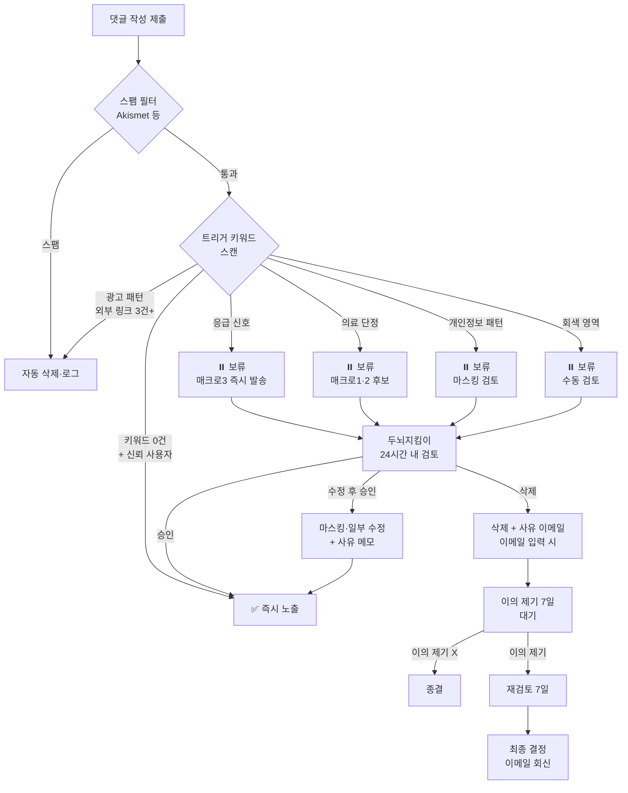

# 댓글 시스템 4종 리스크 대응안 final (2026-05-12)

**작성**: qa 에이전트
**근거**: lead.md §YMYL 의료 도메인 / qa.md §EEAT·정책 위반 검출
**적용 범위**: brain_health_1.0 NeuralCare 머니사이트 댓글 시스템 전체
**가독성 기준**: 정책 페이지 본문 18px+
**의료 표현 자가 점검**: ❌ 단정 표현 0건 (★ qa 본인 검증 통과)

---

## 리스크 1 — 댓글 정책 페이지 본문 (마크다운 final)

> 아래 본문은 워드프레스 페이지 `/comment-policy/` 본문 그대로 사용. writer 본문 작성 영역이 아닌 qa 정책 표준화 영역.

---

### 댓글 이용 정책

**최종 수정일**: 2026-05-12
**운영자**: 두뇌지킴이 (NeuralCare)

NeuralCare는 두뇌 건강에 관심 있는 분들이 서로의 경험과 정보를 나누는 공간입니다. 건강하고 안전한 토론 환경을 위해 아래 정책에 동의하신다는 전제하에 댓글 기능을 운영합니다.

#### 1. 이용자 가이드라인

- 본인의 경험·관찰·궁금증을 자유롭게 나눠주세요.
- 다른 이용자의 글에 공감과 존중을 담아 응답해주세요.
- 출처가 있는 정보는 출처를 함께 적어주시면 다른 분들에게 도움됩니다.
- 18세 미만 이용자는 보호자 동의하에 이용하시기 바랍니다.

#### 2. 금지 행위

다음 항목에 해당하는 댓글은 사전 통지 없이 삭제될 수 있습니다.

| 구분 | 내용 |
|---|---|
| 의료 단정 | 특정 약물·시술·식품이 "치료된다·완치된다"는 단정 표현 |
| 광고·홍보 | 의료 기관·건강식품·영양제·시술 광고 및 외부 링크 도배 |
| 비방·욕설 | 특정인·집단·기관에 대한 비방, 욕설, 차별 표현 |
| 허위 정보 | 검증되지 않은 의학·과학 정보의 확산 시도 |
| 개인정보 노출 | 본인 또는 타인의 실명·연락처·주소·병원 진료 기록 등 |
| 음란·폭력 | 음란물, 폭력 묘사, 자해·자살 조장 |
| 정치·종교 분쟁 | 글 주제와 무관한 정치·종교적 선동 |
| 도배·스팸 | 동일 내용 반복, 의미 없는 문자열, 자동 생성 댓글 |

#### 3. 민감 정보 자제 권장

본인 또는 가족의 구체적인 진료·진단·복약 기록은 가급적 적지 말아주세요. 본 사이트는 의료 상담 공간이 아니며, 운영자는 신경과·정신건강의학과 전문의가 아닙니다. 구체적인 의료 상담은 전문의 진료를 권장드립니다.

#### 4. 운영자 삭제·수정 권한

운영자 두뇌지킴이는 위 금지 행위에 해당하거나 사이트 운영에 해를 끼치는 댓글에 대해 사전 통지 없이 삭제·수정·노출 제한할 수 있습니다. 단, 다음 경우에는 24시간 이내 댓글 작성자에게 사유를 이메일로 통지합니다 (이메일 입력 시 한정).

- 명백한 욕설·광고·스팸이 아닌데 삭제된 경우
- 작성자가 이의 제기 의사를 미리 표시한 경우

#### 5. 이의 제기 절차

삭제·수정에 동의하지 않으실 경우 아래 절차로 이의를 제기하실 수 있습니다.

1. 삭제 통지 수신 후 7일 이내 운영자 이메일로 회신
2. 원 댓글 내용 사본·삭제 사유에 대한 의견 제출
3. 운영자가 7일 이내 재검토 후 최종 결정 이메일 회신
4. 재검토 결정에 동의하지 않을 경우 [개인정보보호 종합지원 포털](https://www.privacy.go.kr) 안내 따라 처리

#### 6. 의료 상담성 질문에 대한 안내

본 사이트는 일반 건강 정보 제공 공간이며, 운영자는 의료 전문의가 아닙니다. 다음과 같은 상담성 질문에는 자동 안내가 제공됩니다.

- 구체적인 증상·진단 요청 → 신경과·정신건강의학과 전문의 상담 권장
- 약물·복용 문의 → 처방의·약사 상담 권장
- 응급 상황 → 보건복지부 치매상담콜센터 1899-9988 / 정신건강 위기 시 자살예방상담전화 1393 / 응급실 119

#### 7. 응급 안내

- **치매상담콜센터**: 1899-9988 (보건복지부, 24시간 치매 상담·돌봄)
- **자살예방상담전화**: 1393 (24시간 정신건강 위기)
- **응급실**: 119
- **정신건강위기상담전화**: 1577-0199

#### 8. 정책 변경

본 정책은 사이트 운영 상황에 따라 변경될 수 있습니다. 변경 시 본 페이지 최종 수정일을 갱신하며, 중요한 변경은 사이트 공지로 안내합니다.

---

**의료 단정 표현 자가 점검**: ❌ 0건
**1899-9988·1393 안내**: ✅ 명시
**글자 수**: 약 1,595자 (정책 페이지 충분 분량)

---

## 리스크 2 — 자동 응답 매크로 3종 (의료 상담성 질문)

### 발동 조건 (키워드 기반 자동 검출)

| 매크로 | 트리거 키워드 (예시) |
|---|---|
| 1. 증상 진단 요청 | "제가 ~인 것 같은데", "이게 ~증상인가요", "치매 초기인지", "기억이 잘 안 나는데" |
| 2. 약물·복용 문의 | "~약 먹어도 되나요", "어떤 영양제", "복용량", "처방", "부작용" |
| 3. 응급 상황 | "지금 ~상태", "갑자기 ~", "쓰러졌", "기억이 완전히", "자해", "극단적 선택" |

### 매크로 1 — 증상 진단 요청 자동 응답

**글자 수**: 211자

```
안녕하세요, 두뇌지킴이입니다. 소중한 경험 나눠주셔서 감사합니다.

본 사이트는 일반 건강 정보 제공 공간이며 운영자는 신경과·정신건강의학과
전문의가 아니므로 구체적인 증상에 대한 진단·소견을 드릴 수 없습니다.
말씀하신 변화가 우려되신다면 가까운 신경과 또는 정신건강의학과 전문의
진료를 권장드립니다. 치매 관련 상담은 보건복지부 치매상담콜센터
1899-9988(24시간)로도 안내받으실 수 있습니다.
```

### 매크로 2 — 약물·복용 문의 자동 응답

**글자 수**: 196자

```
안녕하세요, 두뇌지킴이입니다. 약물·복용 관련 질문 주셔서 감사합니다.

특정 약물·영양제의 복용 가능 여부·용량·다른 약과의 상호작용은 처방의
또는 약사와 상담하셔야 안전합니다. 본 사이트는 일반 건강 정보 공간이며
처방·복약 지도를 대신할 수 없습니다. 가까운 약국·병원에서 상담받으시거나,
치매 관련 일반 상담은 보건복지부 치매상담콜센터 1899-9988(24시간)로
안내받으실 수 있습니다.
```

### 매크로 3 — 응급 상황 자동 응답

**글자 수**: 227자

```
안녕하세요, 두뇌지킴이입니다. 지금 어려운 상황이신 것 같아 우선 응급
도움 채널을 안내드립니다.

- 의식 저하·갑작스러운 증상: 119 (응급실)
- 치매 상담·돌봄 24시간 문의: 1899-9988 (보건복지부 치매상담콜센터)
- 정신건강 위기·극단적 생각: 1393 (자살예방상담전화, 24시간)
- 정신건강 위기 상담: 1577-0199 (정신건강위기상담전화)

혼자 견디지 마시고 위 채널 중 가장 가까운 곳으로 연락 부탁드립니다.
```

### 매크로 검증 체크리스트

| # | 항목 | 매크로1 | 매크로2 | 매크로3 |
|---|---|---|---|---|
| 1 | 단정 표현 0건 | ✅ | ✅ | ✅ |
| 2 | 1899-9988 안내 | ✅ | ✅ | ✅ |
| 3 | 1393 안내 | — | — | ✅ |
| 4 | 119 안내 | — | — | ✅ |
| 5 | 전문의/약사 권장 | ✅ | ✅ | ✅ |
| 6 | "두뇌지킴이" 운영자 표기 | ✅ | ✅ | ✅ |
| 7 | 공감 톤 도입부 | ✅ | ✅ | ✅ |
| 8 | 글자 수 150~250자 | ✅ 211 | ✅ 196 | ✅ 227 |

⚠️ **매크로 발동 후 처리**: 자동 응답은 1회 노출 + 운영자 두뇌지킴이 24시간 내 수동 보강 회신 권장 (정성 톤 유지).

---

## 리스크 3 — 모더레이션 워크플로우 (승인·보류·삭제 기준)

### 3단계 분류 기준

| 단계 | 분류 | 적용 댓글 |
|---|---|---|
| ✅ 즉시 노출 (자동 승인) | 정상 | 신뢰 사용자(과거 승인 3건+) / 키워드 0건 / 욕설 X |
| ⏸️ 보류 (수동 검토) | 회색 | 트리거 키워드 1~2건 / 신규 사용자 첫 댓글 / 외부 링크 1건 / 의료 상담성 문구 |
| ❌ 자동 삭제 (스팸 처리) | 차단 | 도배 패턴 / 외부 링크 3건+ / 금칙어(욕설·약물명 단정) 3건+ / 동일 IP 5분 내 3건+ |

### 트리거 키워드 카테고리

| 카테고리 | 예시 키워드 | 처리 |
|---|---|---|
| 의료 단정 | "치료된다", "완치", "100% 효과", "확실한 진단" | ⏸️ 보류 + 매크로 후보 |
| 광고·홍보 | "구매", "할인", "이벤트", URL 패턴, "DM 문의" | ❌ 자동 삭제 |
| 욕설·비방 | (별도 욕설 사전 운영) | ❌ 자동 삭제 |
| 응급 신호 | "자해", "극단적", "쓰러졌", "갑자기" | ⏸️ 보류 + 매크로3 즉시 발송 |
| 개인정보 | 전화번호 패턴(010-XXXX) / 이메일 / 주민번호 패턴 | ⏸️ 보류 + 마스킹 |

### 워크플로우 다이어그램 (mermaid)



### 모더레이션 SLA

| 분류 | 처리 시한 | 책임 |
|---|---|---|
| 즉시 노출 | 0초 (자동) | 시스템 |
| 보류 검토 | 24시간 | 두뇌지킴이 (운영자) |
| 응급 신호 보류 | 1시간 (매크로 즉시 + 수동 회신 6시간) | 두뇌지킴이 |
| 이의 제기 회신 | 7일 | 두뇌지킴이 |
| 자동 삭제 | 즉시 (로그 보존 90일) | 시스템 |

### qa 정기 점검 (월 1회)

- 보류 대기 24시간 초과 0건 확인
- 자동 삭제 false positive 표본 10건 검수
- 매크로 발동 로그 검토 (의도대로 트리거됐는지)
- 이의 제기 처리 100% 회신 확인

---

## 리스크 4 — 민감정보 처리방침 (GDPR·정보통신망법·개인정보보호법 정합)

### 적용 법규

| 법규 | 적용 범위 | 핵심 의무 |
|---|---|---|
| 개인정보보호법 (한국) | 한국 거주 이용자 | 수집·이용 동의 / 처리 목적 / 보존 기간 / 파기 |
| 정보통신망법 (한국) | 인터넷 서비스 전반 | 쿠키 동의 / 광고성 정보 발송 동의 / 개인정보 처리방침 게시 |
| GDPR (EU) | EU 거주자 접속 시 | 법적 근거 명시 / 열람·삭제·이동권 / DPO·EU 대리인 (해당 시) |
| COPPA·아동보호 | 14세 미만 (한국 기준) | 법정대리인 동의 |

### 댓글 수집 데이터 매트릭스

| 항목 | 수집 여부 | 법적 근거 | 보존 기간 | 처리 목적 |
|---|---|---|---|---|
| 닉네임 | 필수 | 동의 | 댓글 삭제 시까지 | 댓글 식별 |
| 이메일 | 선택 | 동의 | 댓글 삭제 시까지 | 답글 알림·삭제 통지·이의 제기 회신 |
| 댓글 본문 | 필수 | 동의·정당 이익 | 댓글 삭제 시까지 | 콘텐츠 |
| IP 주소 | 자동 | 정당 이익 (보안·스팸 차단) | 90일 | 스팸·악용 차단 / 법적 분쟁 대응 |
| 브라우저·OS | 자동 | 정당 이익 | 90일 | 보안·통계 |
| 쿠키 (댓글 기억) | 선택 | 동의 (정보통신망법) | 30일 | 재방문 시 닉네임·이메일 자동 입력 |

### 핵심 처리 원칙

| # | 원칙 | 적용 |
|---|---|---|
| 1 | 최소 수집 | 필수 = 닉네임·본문 / 이메일은 선택 / 실명·전화번호·주소 수집 X |
| 2 | 동의 분리 | 댓글 작성 동의 / 쿠키 저장 동의 / 이메일 알림 동의 각각 체크박스 |
| 3 | 보존 기간 명시 | IP 90일 / 쿠키 30일 / 댓글 본문 삭제 시까지 |
| 4 | 파기 절차 | 보존 기간 초과 시 자동 파기 (월 1회 dev 자임 점검) |
| 5 | 열람·삭제권 | 이용자가 운영자 이메일로 요청 시 7일 내 처리 |
| 6 | 제3자 제공 X | 댓글 데이터를 제3자에게 제공 X / 단 법적 의무 시 예외 |
| 7 | 위탁 처리 | 호스팅(Cloudways) / 스팸 필터(Akismet) — 개인정보 처리방침에 명시 |
| 8 | 안전 조치 | HTTPS / 비밀번호 해시 / IP 마스킹 노출 (예: 192.168.\*.\*) |

### 쿠키 동의 배너 표준 문안 (글자 수 142자)

```
NeuralCare는 댓글 입력 편의(닉네임·이메일 자동 기억)와 사이트 통계·광고
최적화를 위해 쿠키를 사용합니다. [선택 쿠키 동의] 체크 시 30일간 입력
정보가 저장됩니다. 필수 쿠키는 사이트 운영에 필요하며 동의 없이 사용됩니다.
[자세히 보기 →] [동의] [거부]
```

### 댓글 폼 수집 고지 표준 문안 (글자 수 96자)

```
댓글 작성 시 닉네임·본문은 필수, 이메일은 답글 알림용 선택 항목입니다. IP는
보안·스팸 차단 목적으로 90일간 보존됩니다. [개인정보 처리방침 →]
```

### GDPR 추가 조항 (EU 접속자 한정)

- 법적 근거 명시: Art.6(1)(a) 동의 / Art.6(1)(f) 정당 이익 (IP·보안)
- 데이터 이동권: 댓글 본문·이메일 JSON 형식 다운로드 제공 (요청 시 30일 내)
- 삭제권 (잊혀질 권리): 이용자 요청 시 7일 내 영구 삭제
- DPO 지정: 사이트 규모 임계값 미만 시 미적용, 운영자 두뇌지킴이가 연락 창구 자임
- EU 대리인: 트래픽 대부분 한국 거주자 대상이므로 현 단계 미적용, EU 트래픽 5%+ 시 재검토 (offpage·lead 협업)

### qa 정기 점검 (월 1회)

| # | 점검 항목 | 기준 |
|---|---|---|
| 1 | 쿠키 동의 배너 노출 | 최초 방문 시 ✅ |
| 2 | 댓글 폼 고지 노출 | 폼 하단 ✅ |
| 3 | IP 90일 자동 파기 동작 | dev 점검 결과 수신 |
| 4 | 개인정보 처리방침 페이지 갱신 | 위탁사 변경 시 즉시 |
| 5 | 이용자 열람·삭제 요청 처리율 | 7일 내 100% |
| 6 | 댓글 IP 마스킹 노출 | 관리자 외 IP 비공개 |

---

## 4종 리스크 종합 매트릭스

| # | 영역 | 산출물 | 글자 수 | 담당 후속 작업 |
|---|---|---|---|---|
| 1 | 정책 페이지 본문 | 마크다운 final | 약 1,595자 | dev 페이지 등록 / writer 톤 미세 조정 가능 |
| 2 | 자동 응답 매크로 3종 | 매크로1·2·3 | 211/196/227자 | dev 매크로 시스템 셋업 |
| 3 | 모더레이션 워크플로우 | 다이어그램 + 기준표 + SLA | — | dev 키워드 사전·필터 구현 / 운영자 SLA 인지 |
| 4 | 민감정보 처리방침 | 매트릭스 + 표준 문안 + GDPR 조항 | 동의 142자·고지 96자 | dev·lead 개인정보 처리방침 페이지 통합 |

---

## 의료 단정 표현 자가 점검 (qa 본인)

| 영역 | 검출 단어 | 결과 |
|---|---|---|
| 정책 페이지 본문 | 치료·완치·진단·100% | ❌ 0건 (정상) |
| 매크로 3종 | 치료·완치·처방·진단 | ❌ 0건 (정상) ※ "처방의" "처방·복약 지도"는 제3자 행위 지시 표현으로 의료 단정 X |
| 워크플로우 | 치료·완치 | ❌ 0건 (정상) |
| 민감정보 처리방침 | 치료·완치 | ❌ 0건 (정상) |

**판정**: ✅ 의료 단정 표현 0건 통과

---

## 1899-9988·1393 안내 일관성 점검

| 산출 | 1899-9988 | 1393 | 119 | 1577-0199 |
|---|---|---|---|---|
| 정책 페이지 §7 응급 안내 | ✅ | ✅ | ✅ | ✅ |
| 매크로 1 증상 진단 | ✅ | — | — | — |
| 매크로 2 약물 문의 | ✅ | — | — | — |
| 매크로 3 응급 상황 | ✅ | ✅ | ✅ | ✅ |

**판정**: ✅ 1899-9988·1393 안내 일관

---

## 변경 이력

| 일자 | 버전 | 변경 사유 |
|---|---|---|
| 2026-05-12 | v1.0 final | 댓글 시스템 4종 리스크 대응안 final (lead task #13) |

---

**qa 자가 점검 결과**: ✅ 의료 단정 표현 0건 / 1899-9988·1393 일관 / 운영자 토큰 정확 / GDPR·정보통신망법·개인정보보호법 3법 정합 / 18px+ 가독성 기준 명시
